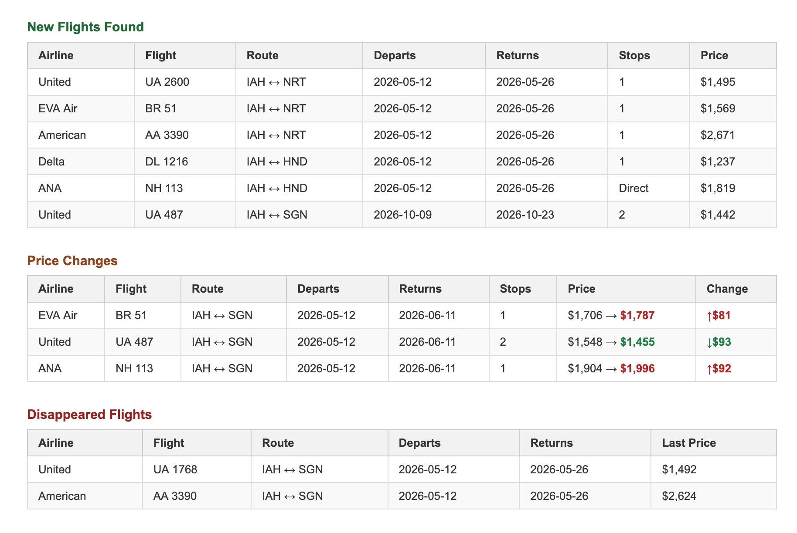

# flight-tracker-python

A scheduled background job that monitors flight prices for specific routes and airlines, saves price history to a SQL Server database, and sends a summary email alert when prices change.

---

## What it does

Runs once per execution, then exits:

1. Checks SerpApi quota — skips the run if not enough searches remain
2. Fetches current prices from Google Flights via SerpApi for all watched routes and dates
3. Compares against the last saved price in the database
4. Sends one HTML summary email via SendGrid if anything changed
5. Saves all fetched prices to the database for future comparisons

Alert types reported per run:
- **New flight** — a flight number not seen before for that route and date
- **Price change** — price moved by more than the configured threshold
- **Disappeared flight** — a previously seen flight no longer appearing in results

---

## Email preview



[View full HTML preview](docs/email_preview.html)

---

## Routes and airlines watched

Routes, airlines, trip lengths, and outbound date offsets are all configured in `app/config.py`.

---

## Tech stack

| Layer | Technology |
|---|---|
| Price data | SerpApi (Google Flights) |
| Database | SQL Server (Azure SQL / local Docker) |
| Python DB driver | pyodbc + SQLAlchemy |
| Email alerts | SendGrid |
| Scheduling | Azure Container Apps Job (external cron) |
| Container | Docker |

---

## Project structure

```
app/
├── main.py        — entry point: init DB → quota check → check prices → send alert → exit
├── config.py      — routes, airlines, env var loading
├── checker.py     — fetch prices, compare against DB, build findings list
├── serpapi.py     — SerpApi API client
├── notifier.py    — HTML email builder and SendGrid sender
└── db.py          — SQLAlchemy models and DB access functions

tests/
├── test_checker.py   — 12 tests for price comparison logic
├── test_serpapi.py   — 6 tests for API filtering and error handling
└── test_notifier.py  — 9 tests for email formatting and send behaviour
```

---

## Local setup

**Prerequisites:** Python 3.12, pyenv, Poetry, ODBC Driver 18 for SQL Server, Docker Desktop

```bash
# Clone and set Python version
pyenv local 3.12.11

# Install dependencies
poetry install

# Copy and fill in environment variables
cp .env.example .env
```

Start a local SQL Server instance (Azure SQL Edge — ARM compatible):

```bash
docker run -e "ACCEPT_EULA=1" -e "MSSQL_SA_PASSWORD=<your_password>" \
  -p 1434:1433 \
  mcr.microsoft.com/azure-sql-edge
```

Create the `FlightTracker` database in Azure Data Studio or via `sqlcmd`, then run:

```bash
poetry run python -m app.main
```

The app creates tables automatically on first run.

---

## Environment variables

Copy `.env.example` to `.env` and fill in your values. All available variables and their descriptions are documented in that file.

---

## Running tests

```bash
poetry run pytest tests/ -v
```

No real database or API key needed — all external calls are mocked.

